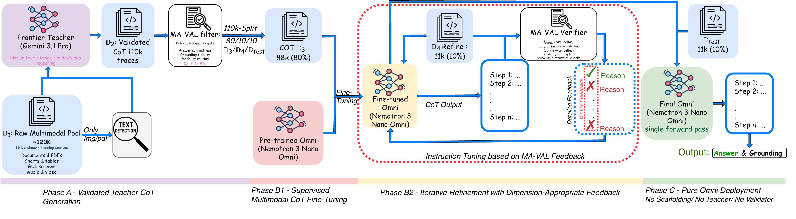
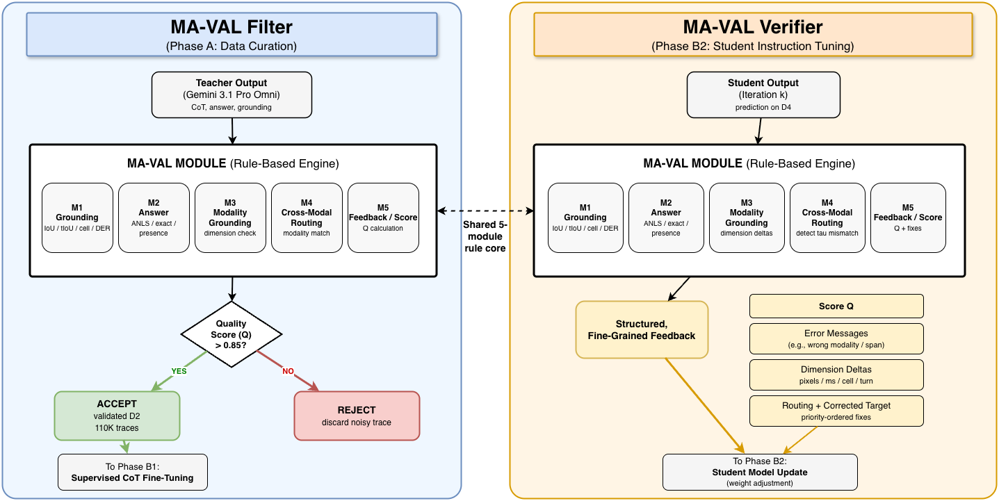

# OmniVAL

**Validated Chain-of-Thought Distillation for True Native Omni Models**

OmniVAL is an object-oriented reference implementation of a validated multimodal reasoning distillation pipeline for true native omni models. The codebase mirrors the paper's full system design: frontier-teacher chain-of-thought generation, MA-VAL rule-based validation, supervised multimodal CoT fine-tuning, verifier-driven iterative refinement, and pure omni deployment without inference-time scaffolding.

This repository is designed as a reproducible engineering scaffold: the core algorithms, metrics, configs, benchmark registry, ablation tables, and adapter interfaces are implemented locally, while proprietary APIs, model weights, private datasets, and large-cluster training backends are intentionally exposed through clean extension points.

## Architecture



**Figure 1.** OmniVAL pipeline: Phase A validates frontier-teacher CoT traces, Stage B1 fine-tunes a Nemotron 3 Nano Omni student on validated multimodal reasoning, Stage B2 refines the student with dimension-appropriate MA-VAL feedback, and Phase C deploys the final omni student as a single forward-pass model.



**Figure 2.** MA-VAL operates in two modes over a shared five-module rule core: Filter mode accepts or rejects teacher traces during data curation, while Verifier mode emits structured feedback for student refinement.

## What Is Implemented

- **MA-VAL validator** with five rule-based modules: grounding, answer correctness, modality-aware grounding, cross-modal routing, and reasoning feedback.
- **Grounding metrics** for spatial IoU, temporal IoU, table-cell F1, diarization overlap, ANLS, and correction vectors.
- **Phase A teacher-trace generation** with training-only scaffolding and quality-threshold filtering.
- **Stage B1 supervised CoT training interface** for full student fine-tuning.
- **Stage B2 iterative refinement** with verifier feedback, corrected targets, convergence tracking, and instruction-tuning records.
- **Phase C deployment abstraction** that preserves the paper's no-teacher, no-validator, no-OCR/ASR/segmenter inference requirement.
- **Adapters** for teacher models, student models, and training-time scaffolding tools.
- **Catalogs** for all paper baselines, teacher ablations, scaffolding tools, and all 16 benchmarks.
- **Paper result tables** for main results and ablations in machine-readable form.
- **Offline smoke pipeline** that runs end to end without external APIs or large model checkpoints.

## Repository Layout

```text
.
+-- configs/
|   +-- benchmarks.json
|   +-- omnival_default.json
+-- src/omnival/
|   +-- benchmarks.py
|   +-- cli.py
|   +-- config.py
|   +-- data.py
|   +-- metrics.py
|   +-- models.py
|   +-- pipeline.py
|   +-- results.py
|   +-- sample_data.py
|   +-- scaffolding.py
|   +-- training.py
|   +-- validator.py
+-- tests/
|   +-- test_metrics_validator.py
|   +-- test_pipeline_smoke.py
+-- figure1.png
+-- figure2.png
+-- pyproject.toml
+-- README.md
```

## Quickstart

The local path is dependency-free Python. Python 3.10 or newer is required.

```bash
git clone git@github.com:ahmad-shirazi/OmniVal.git
cd OmniVal

python -m venv .venv
source .venv/bin/activate
python -m pip install -e .
```

Run the offline end-to-end pipeline:

```bash
omnival smoke
```

Expected output is a JSON summary with accepted Phase A traces, train/refinement/test split sizes, B2 iteration count, score history, and correction count.

Run the test suite:

```bash
python -m unittest discover -s tests
```

## CLI

Print the model catalog, benchmark registry, and default hyperparameters:

```bash
omnival catalog
```

Print paper-reported result and ablation tables:

```bash
omnival paper-results
```

Print a single table:

```bash
omnival paper-results --table table_4_voice_asr_diarization
```

Run the synthetic offline pipeline:

```bash
omnival smoke
```

## Core Concepts

### MA-VAL

`MAValidator` implements the paper's dual-mode validator:

- **Filter mode** scores teacher-generated traces and retains examples with `Q > 0.85`.
- **Verifier mode** scores student predictions and emits actionable feedback: error messages, dimension-specific correction vectors, corrected targets, and priority-ordered fixes.

The aggregate score follows the paper's weighting:

```text
Q = 0.35 * Q_answer + 0.35 * Q_grounding + 0.15 * Q_modality + 0.15 * Q_reasoning
```

### Grounding Spaces

OmniVAL supports the coordinate spaces required by the benchmarks:

- **Spatial:** document regions, chart elements, GUI click targets, and image boxes.
- **Temporal:** video moments, audio spans, ASR segments, and voice interactions.
- **Structured:** table cell spans.
- **Diarization:** speaker-turn segments.

### Training-Time Scaffolding

The repository includes adapter classes for the paper's scaffolding tools:

- DB-ResNet for text detection.
- SAM 2.1 for segmentation.
- Whisper v3 for ASR and forced-alignment style evidence.
- SigLIP for keyframe evidence.
- pyannote for diarization evidence.
- TableFormer for table structure evidence.

These tools are represented as training-time validators only. The student model interface never receives scaffolding evidence at inference.

## Models Covered

The model catalog includes every model family discussed in the paper:

- **Default teacher:** Gemini 3.1 Pro.
- **Closed-source omni baselines:** Gemini 3.1 Pro, Gemini 2.5 Pro, GPT-4o.
- **Open-source omni baselines:** Nemotron 3 Nano Omni, Qwen3-Omni, NExT-OMNI.
- **Teacher ablations:** Gemini 2.5 Flash, GPT-4o, Claude 4.5 Sonnet, GPT-5, Qwen3-VL-235B-A22B-Thinking, Llama 4-400B-A17B.
- **Document-specialist baselines:** DocLayLLM, LayoutLLM, LayTextLLM, DLaVA.

Real API calls and checkpoint training are intentionally not hard-coded. Implement production integrations by subclassing `TeacherModel`, `StudentModel`, or `ScaffoldingTool`.

## Benchmarks Covered

The registry covers all 16 benchmarks used in the paper:

| Area | Benchmarks | Metrics |
| --- | --- | --- |
| Document understanding | DocVQA, VisualMRC, FUNSD, CORD, SROIE | ANLS, mAP |
| Newer document reasoning | OCRBenchV2-En, MMLongBench-Doc, CharXiv | official scores |
| GUI agency | ScreenSpot-Pro, OSWorld | click accuracy, task success |
| Video and audio-visual reasoning | Video-MME, WorldSense, DailyOmni | official scores |
| Voice and speech | VoiceBench, HF Open ASR, DIHARD III | score, WER, DER |

Official leaderboard integration points are provided through `BenchmarkRegistry` and `BenchmarkEvaluator`. Hidden test-set servers and benchmark-specific scripts should be wired there.

## Reproducing the Paper Pipeline

The intended production flow is:

1. Build a raw multimodal pool `D1` from benchmark training sources.
2. Run scaffolding tools over each example for validation-only evidence.
3. Use a teacher adapter to generate modality-routed CoT traces.
4. Filter traces with `MAValidator` in Filter mode to construct `D2`.
5. Stratify `D2` into `D3`, `D4`, and `Dtest` using the configured 80/10/10 split.
6. Train the student through the Stage B1 interface on validated CoT traces.
7. Run Stage B2 verifier refinement until convergence.
8. Evaluate the final student with official benchmark protocols.
9. Deploy only the fine-tuned student for pure omni inference.

The local `omnival smoke` command executes the same control flow with synthetic examples and offline adapters.

## Configuration

The default paper-aligned configuration is available at `configs/omnival_default.json` and in `src/omnival/config.py`.

Key defaults:

| Component | Value |
| --- | --- |
| Teacher | Gemini 3.1 Pro |
| Student | Nemotron 3 Nano Omni |
| Phase A raw pool | 120K examples |
| Validated corpus | 110K traces |
| Split | 80% train, 10% refinement, 10% test |
| MA-VAL threshold | `Q > 0.85` |
| Stage B1 | 3 epochs, LR `1.5e-4`, effective batch 128 |
| Stage B2 | max 20 iterations, LR `1e-5`, effective batch 64 |
| Convergence | 3-iteration window, mean delta `< 0.2` |

## Development

Run all tests:

```bash
python -m unittest discover -s tests
```

Run syntax compilation:

```bash
python -m compileall -q src tests
```

Run commands without installation:

```bash
PYTHONPATH=src python -m omnival smoke
PYTHONPATH=src python -m omnival catalog
PYTHONPATH=src python -m omnival paper-results
```

## Current Scope

This repository contains the implementation scaffold and local validation harness. It does not include:

- Proprietary teacher API credentials.
- Nemotron 3 Nano Omni weights or training backend configuration.
- Benchmark datasets or hidden leaderboard submissions.
- The 8xH100 training infrastructure used for the paper-scale run.
- Private or non-distributable paper artifacts.

Those pieces can be added through the adapter interfaces without changing the MA-VAL core or orchestration logic.

## Citation

```bibtex
@misc{omnival2026,
  title = {OmniVAL: Validated Chain-of-Thought Distillation for True Native Omni Models},
  year = {2026},
  note = {Reference implementation}
}
```
# OmniVal
